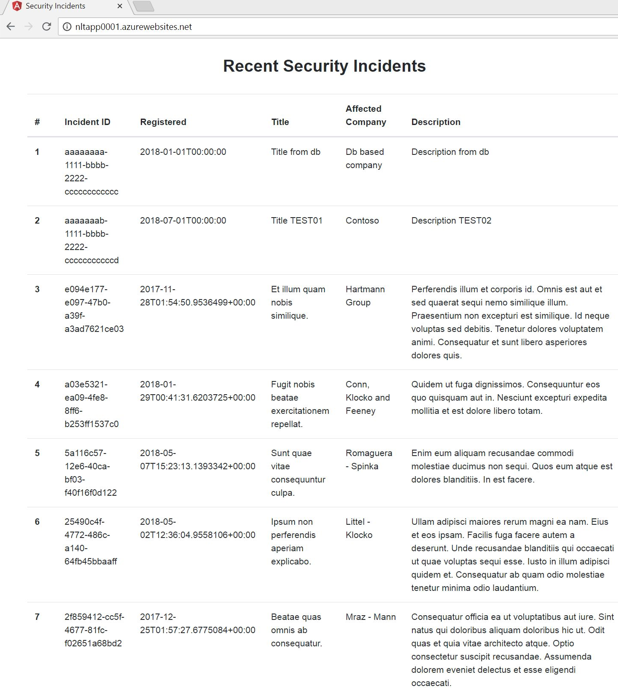
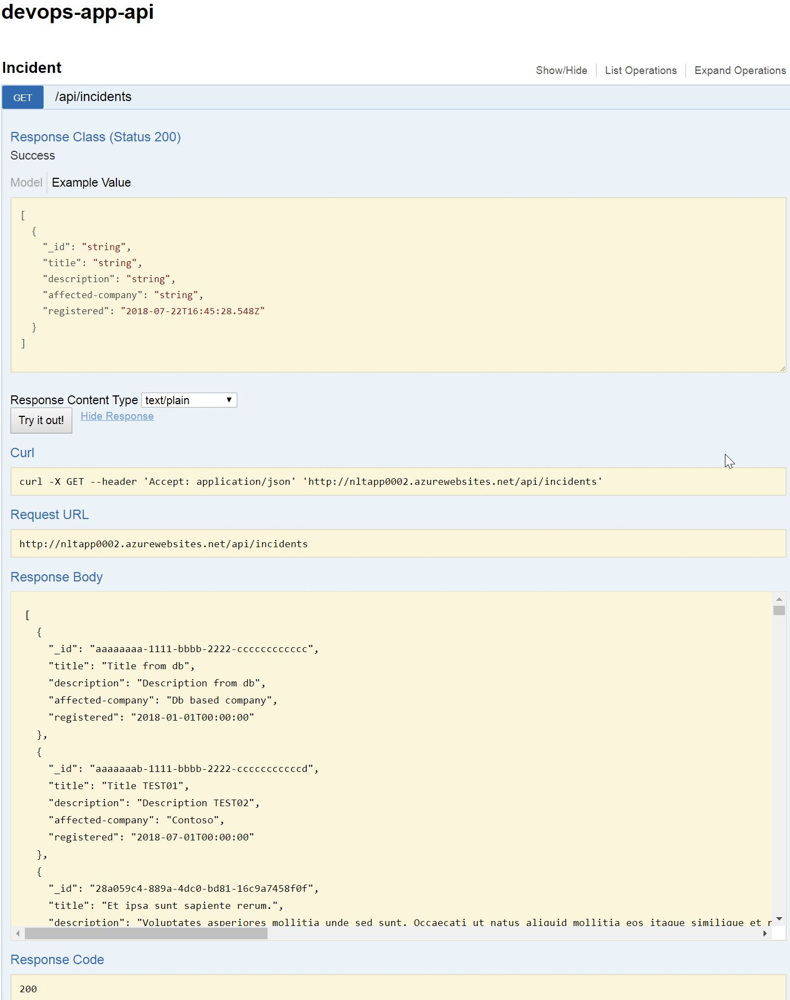
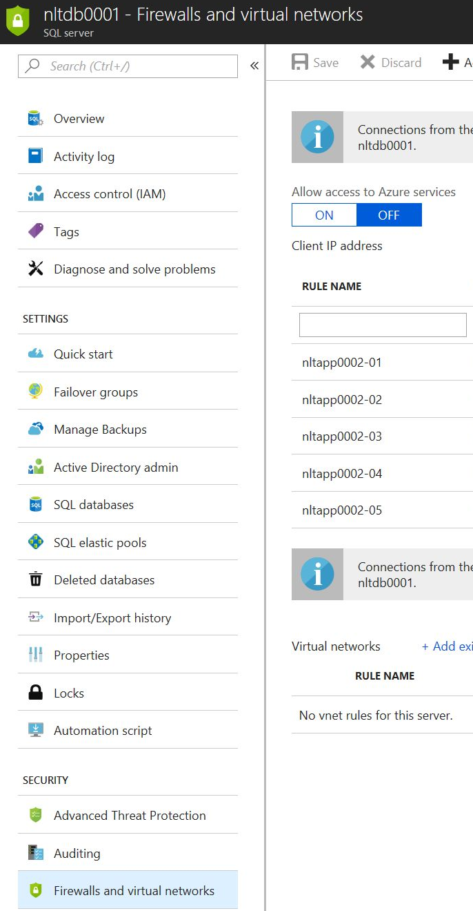

## Introduction 
The documentation contains resolution description for DevOps take home. 

## Output

 - Front-end application can be found:  
http://nltapp0001.azurewebsites.net/  
 - We can see new entries from related DB as well:    
   

## Infrastructure underneath 

- Two App Services on App Service Plan and single Azure SQL Server with a DB  

-  Backend is properly communicating with DB showing entries, e.g.:  
   
-  Azure SQL is protected by Firewall with whitelisting only IPs of back-end App Service:  
   

## Future improvements  

### For strengthen Backend API from external we could use: 
  - When keeping the current App Service architecture. Then implement Service to Service authentication (with e.g. auth tokens)  
  That will respond with 401 when reaching particular endpoint when not authenticated (but not 403 that doesn't exist).  

  - Change infrastructure architecture to Service Fabric with Application Gateway. For external, publicly exposed endpoint so front-end would be dedicated API rules in the Application Gateway (under Rules aka ReverseProxy). Further for internal use only there will be the back-end service with /api/incidents. Then rest of incoming requests blocked under HTTP Settings.  
  Diagram can be prepared upon request.  
  To accomplish such scenario my current Azure subscription's limit will be exhausted in 4 days. 

  - Azure Service Environments with internal load balancer
  My Azure subscription will be exhausted in 2 working days.       

### To further more protect SQL from outside: 
 - With Service Fabric or ASE approach. Using VNET Service Endpoint with rule to the Azure SQL DB - to whitelist the only VNET's subnet. [Official doc](https://docs.microsoft.com/en-us/azure/sql-database/sql-database-vnet-service-endpoint-rule-overview)
 - If there is a security need to totally not having available any external DNS name for DB. Then we need to have dedicated VM with MS SQL installed with only Private IP. Then back-end would be in the same network's subnet and reaching such Private DB IP.  

 ## Release pipeline   
 
The solution has been prepared in Visual Studio Team Services with leveraging: 
 - Using Build for building back-end App - dotnet Build task  
 - Using Release to:
   - Publish back-end App to App Service from Build's artefact
   - Publish front-end to App Service
Further e.g. screenshots are available upon request.  
Creation of App Service Plan and App Services, Azure SQL and DB then Firewall rules can be included in Release definition  as well. Then would be closer to IaaC approach.  
